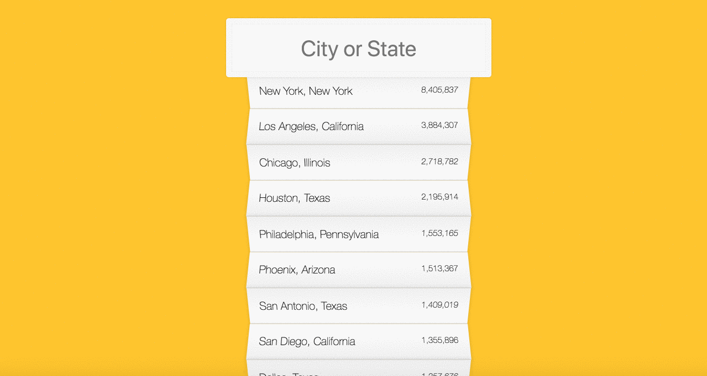

# Type Ahead AJAX

## Objective:

Declare a variable which will contain an array and fetch the data from the provided endpoint, pushing the return values into the array. We'll need to attach an event listener to the input HTML element that will listen for the 'keyup' event, and call a yet-to-be-defined event handler function that will be responsible for formatting the data and displaying it on the page. Within the body of the event handler function we will call upon another function (which we will define) that will be responsible for matching the inputted text and the values we received from the endpoint. How do we match the data from the endpoint with the user's inputs? Regular expressions, wooooo!

## Guide:

Steps:

Declare three variables, one which will contain the data returned from the endpoint in an array, one that will reference the input HTML element, and one that will reference the unordered list HTML element.

Modern browser APIs provide us with an experimental fetch method that fetches resources (including across network) and returns a Promise containing the response in a Response object. We'll use this method to get our data from the provided endpoint, convert the response to JSON, and then push the items into our array.

Attach an event listener to the input HTML element which will listen for the 'keyup' event and call upon a function as the event handler that will be responsible for displaying the matched data.

Define a function that will be responsible for finding matches between the inputted text and the data received from the endpoint.

This function will accept two parameters; the inputted text and the array containing the data from the endpoint. In the body of the function, we'll filter through the array, using a new instance of a Regular Expression object. This object will accept the inputted text as the pattern to match, and will have flags set to find all matches (rather than stopping at the first match) and to ignore text casing (learn about the RegExp constructor here).
Match the inputted text with the city or state properties of the objects contained within our array. This function will be utilized in the body of the event handler function.
Define the function to be used as the event handler.

In the body of this function, declare a variable and define it as the response from calling the function in Step 4, passing in the value of the function context (the inputted text) and the variable containing our endpoint data as arguments. This variable now contains an array of items from our dataset that match the inputted text.
Declare another variable and define it as the result of mapping over the array referenced in the previously declared variable. In the body of the map method, we'll declare two new variables which will target the city and state properties of each object in the array we're mapping over and replace those properties with the necessary HTML to highlight them. Finally, we'll return a template string containing two list items; one will display the city and state using the variables we just defined, and the other will display the population. The result of this map method will be an array of template strings that we can join together to be one BIG template string.
Target the inner HTML of the unordered list (using the variable defined in Step 1) and set it as the variable containing the big template string.
Format the population so that it's separated by commas. We can use this function:

``function numberWithCommas(x) {
  return x.toString().replace(/\B(?=(\d{3})+(?!\d))/g, ',');
}``